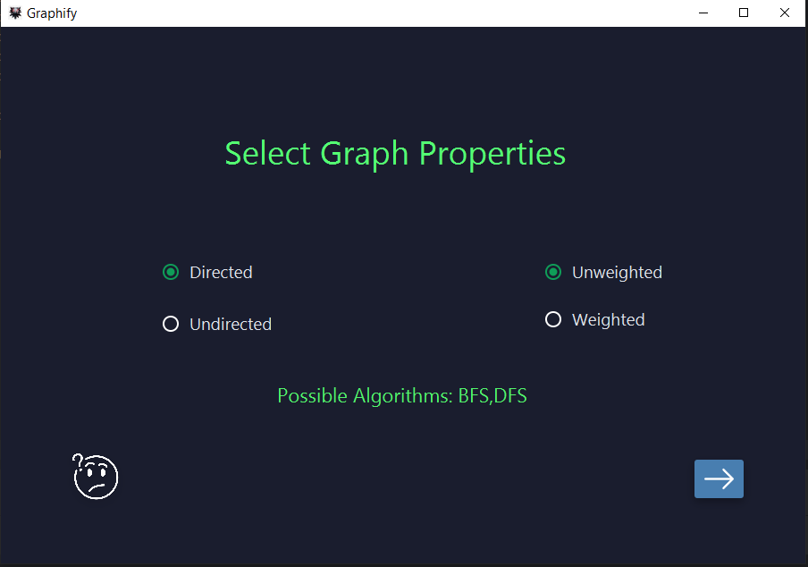
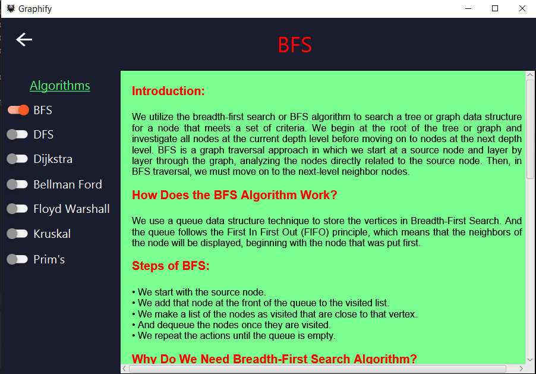
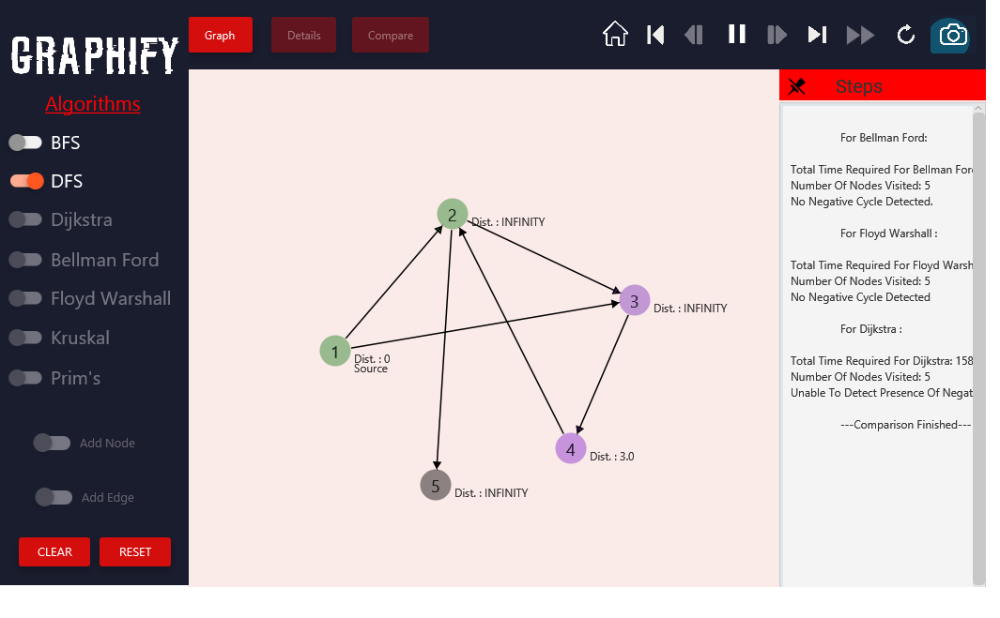
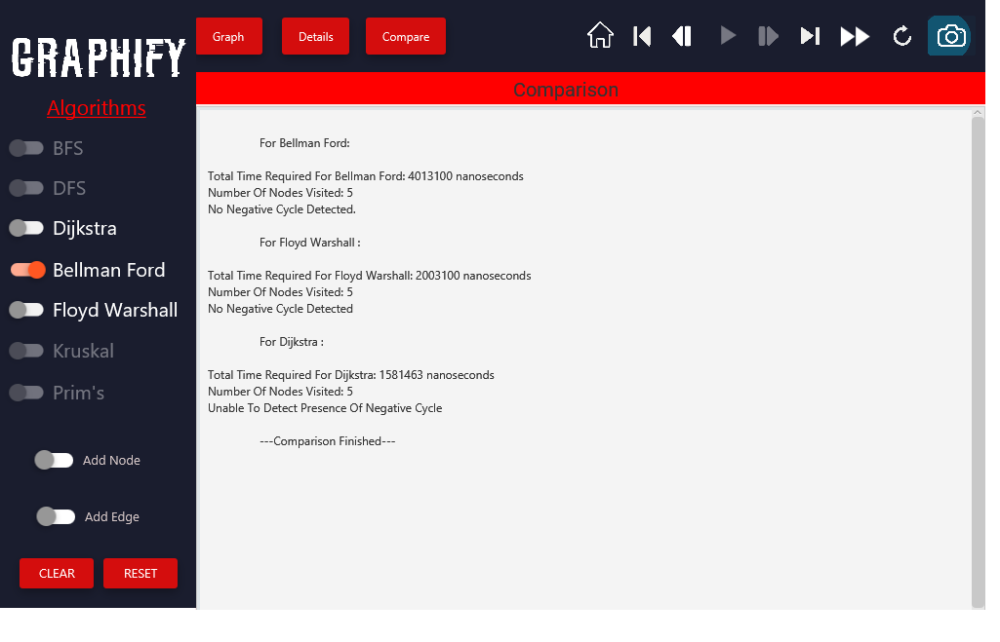
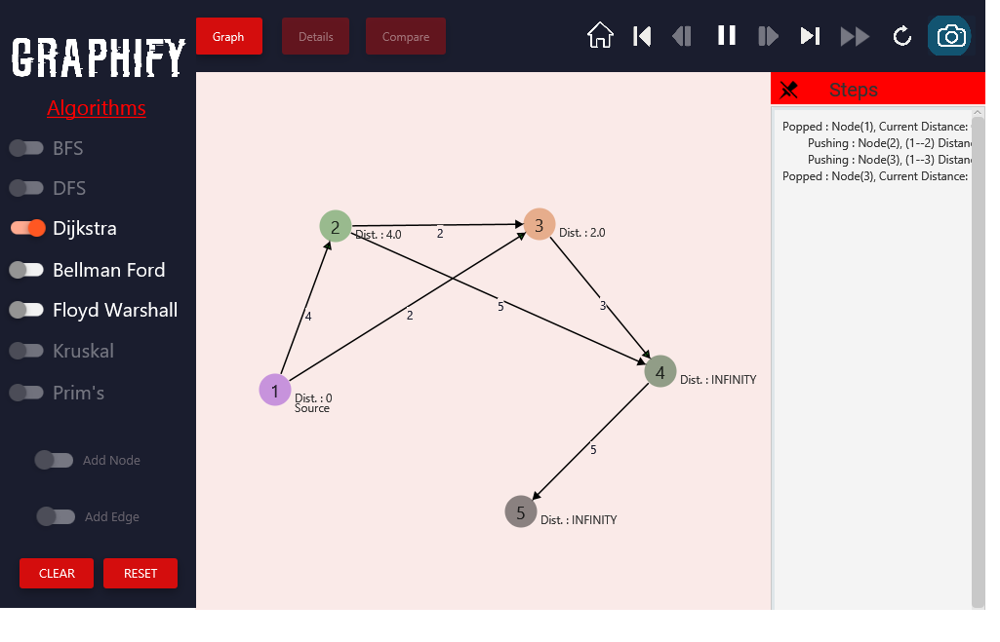

## Overview
An algorithm based graph simulator.
## Features
- **Interactive Visualization**: Visualize algorithms with interactive animations to understand their behavior better.
- **Step-by-Step Execution**: Execute algorithms step-by-step to see how they progress through each iteration.
- **Multiple Algorithms**: Implementations of various graph algorithms (e.g., DFS, BFS, Dijkstra, Floyd Warshall, Bellman Ford, Kruskal, Prim's etc).
- **Customizable Parameters**: Adjust parameters such as animation speed, and input data to tailor the visualization experience.
- **User-Friendly Interface**: Intuitive UI design for seamless interaction and easy navigation.

## Algorithms
1. BFS
2. DFS
3. Dijkstra's Shortest Path Algorithm
4. Bellman Ford's Shortest Path Algorithm
5. Floyd Warshall Shortest Path Algorithm
6. Kruskal's Minimum Spanning Tree
7. Prim's Minimum Spanning Tree

## How to Run
1. Clone the repo to your local machine.
```bash
git clone https://github.com/NazmusSadiq/Graphify.git
```
2.Open it in your preferred IDE and setup JavaFX.
3.Then add the JAR files to your dependencies from lib under resources.If your're using IntelliJ then navigate to File > Project Structure > Project Settings > Modules > Dependencies. Then add the JARs under Dependencies.
  - `controlsfx-11.2.1.jar`
  - `jfoenix-21.0.0.jar`
  - `jfxtras-common-17-r1.jar`
4. Run `AlgorithmVisualizerMenu.java`.

## Screenshots
### Start Screen

### Tutorial

### DFS

### Bellman Ford

### Dijkstra



## Acknowledgements
This is made as the final project for CSE 4402: Visual Programming Lab.

**Team publicStaticVoidMain**

[MD. Nazmus Sadiq | 210041139]

[Ankon Ahamed | 210041147]

[Jobayer Rahman Rafy | 210041127]
